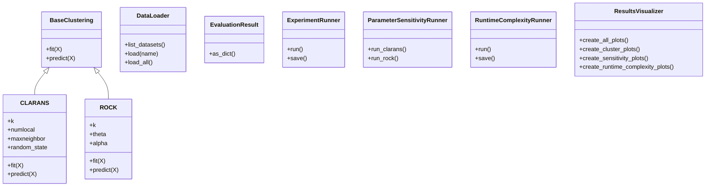
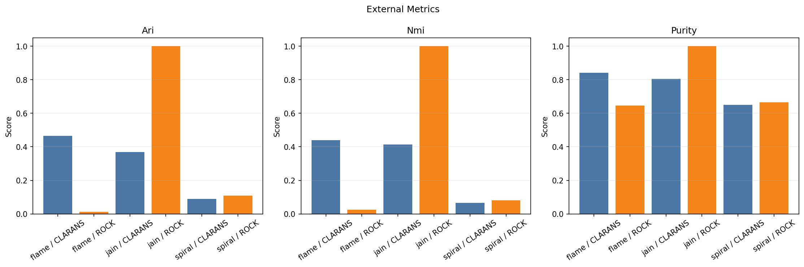
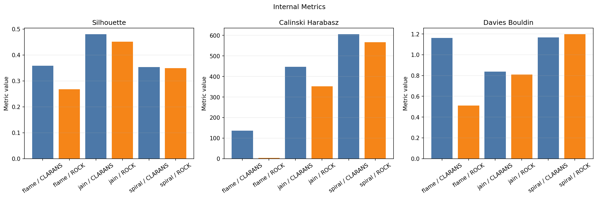
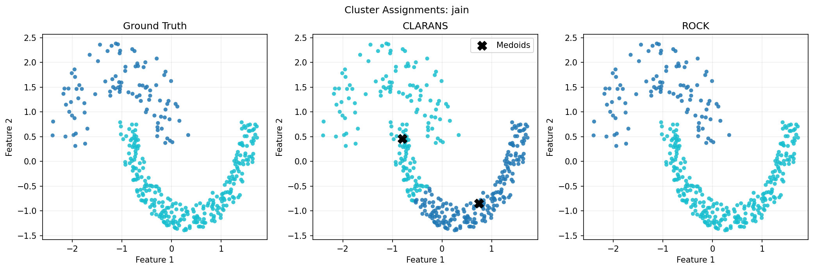
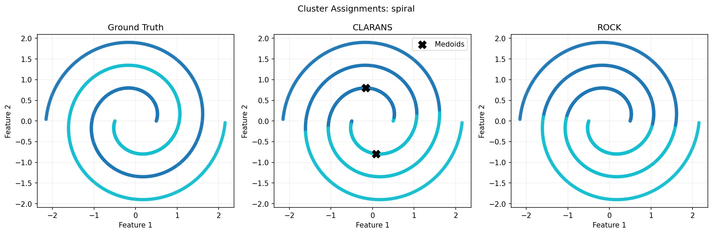
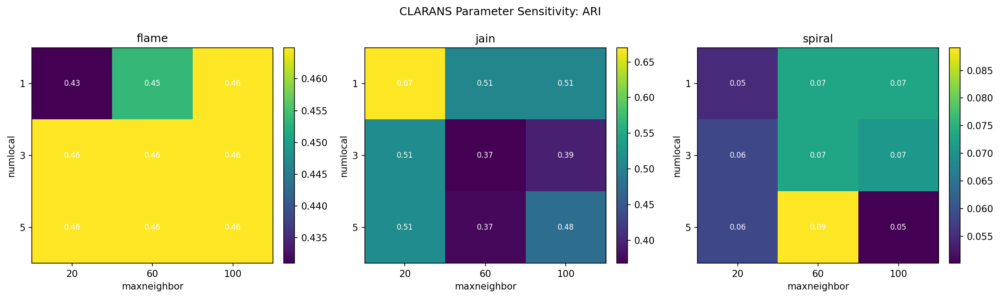
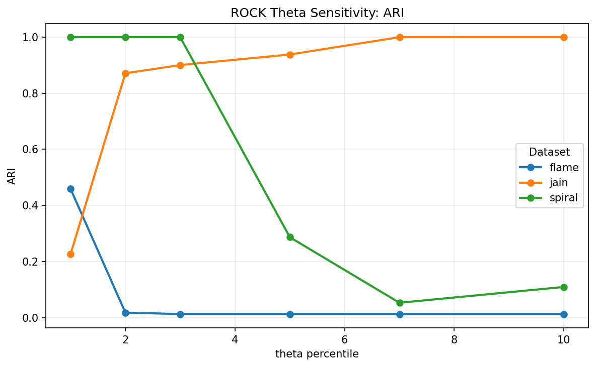
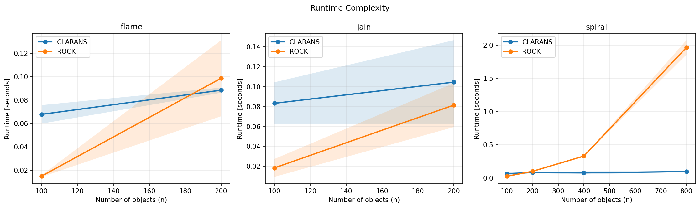

# Final Report: CLARANS and ROCK Clustering Algorithms

Authors: Dominika Mlynarska, Wojciech Grunwald, Viktoriia Vlasenko  
Course: EDAMI  
Date: June 2026

## 1. Problem Definition and Introduction

The goal of the project was to prepare, implement, and experimentally verify two clustering algorithms: CLARANS and ROCK. Clustering is an unsupervised data mining task in which objects are grouped so that objects in the same group are more similar to each other than to objects in other groups.

The selected algorithms represent two different clustering approaches:

- CLARANS is a randomized partitioning algorithm based on medoids.
- ROCK is a hierarchical agglomerative algorithm based on links, meaning common neighbors.

The final implementation focuses on comparing the behavior of both algorithms on publicly available benchmark datasets. The project also includes data loading, evaluation, experiment execution, and visualization modules so that experiments can be reproduced and extended.

The feedback received after the first part of the project stated that test data should be taken from the `deric/clustering-benchmark` repository. The final version follows this requirement and uses datasets from that benchmark instead of only generated toy datasets.

## 2. Description of the Proposed Algorithms with Literature Reference

### CLARANS

CLARANS, or Clustering Large Applications based on RANdomized Search, was proposed by Ng and Han as an efficient medoid-based clustering method for spatial data mining. It is related to PAM and CLARA, but instead of checking all possible medoid swaps, it searches the graph of possible medoid sets randomly.

The main idea is:

1. Randomly choose `k` medoids.
2. Assign every object to the nearest medoid.
3. Evaluate the total clustering cost.
4. Randomly generate a neighboring solution by swapping one medoid with one non-medoid.
5. If the neighbor improves the cost, move to it.
6. Stop a local search after `maxneighbor` unsuccessful neighbor checks.
7. Repeat the process `numlocal` times and keep the best solution.

The cost minimized by CLARANS is:

```text
Cost = sum over all objects x of min distance(x, medoid)
```

CLARANS is well suited to compact, center-like clusters. Because it uses medoids, cluster representatives are real objects from the dataset. Its main limitation is that it still assumes that good clusters can be represented by central objects, which makes it less effective on strongly non-convex shapes.

### ROCK

ROCK, or Robust Clustering Algorithm for Categorical Attributes, was proposed by Guha, Rastogi, and Shim. It was originally designed for categorical data, where simple distance-based centroid methods are often unsuitable. Instead of relying only on direct distance, ROCK measures similarity using the number of common neighbors between objects or clusters.

The implemented version adapts ROCK to numerical benchmark datasets by constructing a neighbor graph using Euclidean distance and a threshold `theta`. Two points are considered neighbors when their distance is not greater than `theta`.

The main idea is:

1. Build a neighbor graph using threshold `theta`.
2. Compute links between object pairs as the number of common neighbors.
3. Start with each object as a separate cluster.
4. Compute a goodness score for merging cluster pairs.
5. Repeatedly merge the cluster pair with the highest goodness score.
6. Stop when the requested number of clusters is reached, or when no valid merge remains.

The merge goodness follows the ROCK idea:

```text
g(Ci, Cj) = link(Ci, Cj) /
            ((ni + nj)^(1 + 2a) - ni^(1 + 2a) - nj^(1 + 2a))
```

where `ni` and `nj` are cluster sizes and `a` is the algorithm parameter controlling the denominator. In the implementation, the default value is `alpha = 0.5`.

ROCK can detect non-convex structures when the threshold is chosen well, but it is highly sensitive to `theta` and is more memory-intensive because it works with pairwise relationships.

ROCK can also be viewed in the broader family of graph-based hierarchical clustering methods. Karypis, Han, and Kumar's CHAMELEON algorithm is an important related example. CHAMELEON first models data as a graph and then merges clusters using dynamic information about both interconnectivity and closeness. This context is useful for interpreting ROCK: both methods move beyond simple centroid or medoid assumptions, but ROCK uses common-neighbor links and a thresholded neighbor graph, while CHAMELEON uses a more adaptive dynamic model.

## 3. Design of the Implementation

The project is organized into separate modules:

- `ClusteringAlgorithms/`: implementations of CLARANS and ROCK.
- `DataLoader/`: loading and preprocessing benchmark datasets.
- `Evaluation/`: internal and external clustering metrics.
- `Experiments/`: baseline, parameter sensitivity, and runtime complexity experiment runners.
- `Visualization/`: plots for metrics, cluster assignments, sensitivity, and runtime.
- `data/benchmark/`: cached ARFF benchmark datasets.
- `results/`: generated CSV files and plots.

The main classes and modules are:



Scikit-learn is used only for preprocessing and evaluation metrics, not for implementing CLARANS or ROCK. The clustering algorithms themselves are implemented in the project code.

## 4. Important Design and Implementation Issues

### Unified Algorithm Interface

Both algorithms implement a common interface with `fit()` and `predict()` methods. This makes it possible to run the same experiment code for both CLARANS and ROCK.

### Reproducibility

CLARANS is randomized, so the implementation accepts `random_state`. Experiment runners use fixed seeds to make results reproducible.

### Data Preprocessing

The benchmark datasets are loaded from ARFF files and standardized before clustering. Standardization is important because both implemented methods use Euclidean distances in the final version.

### ROCK Threshold Choice

ROCK is very sensitive to `theta`. The implementation allows:

- a fixed `theta`,
- automatic threshold selection,
- a percentile-based threshold through experiment and visualization commands.

This issue is central to the final analysis because different thresholds can produce very different clusterings.

### Pairwise Memory Cost in ROCK

ROCK constructs pairwise distance and neighbor/link information. This makes it significantly more memory-demanding than CLARANS for larger datasets. The final experiments include runtime complexity analysis, while explicit memory profiling remains a recommended extension.

### Handling Incomplete Merging

If the ROCK priority queue becomes empty before the requested number of clusters is reached, the algorithm returns the remaining active clusters. This happened in some runs, for example for `flame` with the default threshold.

## 5. Objective and Method of Carrying Out Experiments

The experiments were designed to answer the following questions:

1. Do the implemented algorithms run correctly on benchmark clustering datasets?
2. How good are the obtained clusters compared with ground truth labels?
3. How do internal metrics compare with external metrics?
4. How sensitive are CLARANS and ROCK to their main parameters?
5. How does runtime change when the number of objects increases?

The following metric groups were used:

- External metrics, using ground truth labels:
  - Adjusted Rand Index (ARI)
  - Normalized Mutual Information (NMI)
  - Purity
- Internal metrics, using only data and predicted labels:
  - Silhouette coefficient
  - Calinski-Harabasz score
  - Davies-Bouldin score
- Performance metric:
  - Runtime in seconds

The external metrics are the most important for correctness analysis because benchmark labels are available. Internal metrics are useful but can be misleading, especially on non-convex datasets.

## 6. Performed Experiments and Input Data

All final experiments use public datasets from:

```text
https://github.com/deric/clustering-benchmark
```

The cached files are stored in `data/benchmark/`.

| Dataset | Objects | Features | Ground truth clusters | File |
| --- | ---: | ---: | ---: | --- |
| flame | 240 | 2 | 2 | `data/benchmark/flame.arff` |
| jain | 373 | 2 | 2 | `data/benchmark/jain.arff` |
| spiral | 1000 | 2 | 2 | `data/benchmark/spiral.arff` |

The performed experiments were:

1. Baseline comparison of CLARANS and ROCK on all datasets.
2. Cluster assignment visualization for ground truth, CLARANS, and ROCK.
3. CLARANS parameter sensitivity over `numlocal` and `maxneighbor`.
4. ROCK parameter sensitivity over `theta_percentile`.
5. Runtime complexity analysis using increasing sample sizes and repeated measurements.

Generated result files:

- `results/evaluation_results.csv`
- `results/clarans_parameter_sensitivity.csv`
- `results/rock_parameter_sensitivity.csv`
- `results/runtime_complexity.csv`

Generated plots:

- `results/plots/external_metrics.png`
- `results/plots/internal_metrics.png`
- `results/plots/runtime_comparison.png`
- `results/plots/clusters_flame.png`
- `results/plots/clusters_jain.png`
- `results/plots/clusters_spiral.png`
- `results/plots/clarans_sensitivity_ari.png`
- `results/plots/clarans_sensitivity_runtime.png`
- `results/plots/rock_sensitivity_ari.png`
- `results/plots/rock_sensitivity_runtime.png`
- `results/plots/runtime_complexity.png`
- `results/plots/runtime_complexity_log.png`

## 7. Obtained Results

### Baseline Results

| dataset | algorithm | n_samples | n_clusters | ari | nmi | purity | silhouette | runtime_seconds |
| --- | --- | --- | --- | --- | --- | --- | --- | --- |
| flame | CLARANS | 240 | 2 | 0.465 | 0.439 | 0.842 | 0.358 | 0.065 |
| flame | ROCK | 240 | 3 | 0.013 | 0.024 | 0.646 | 0.267 | 0.135 |
| jain | CLARANS | 373 | 2 | 0.368 | 0.415 | 0.804 | 0.480 | 0.067 |
| jain | ROCK | 373 | 2 | 1.000 | 1.000 | 1.000 | 0.451 | 0.443 |
| spiral | CLARANS | 1000 | 2 | 0.089 | 0.066 | 0.650 | 0.353 | 0.101 |
| spiral | ROCK | 1000 | 2 | 0.109 | 0.081 | 0.666 | 0.349 | 4.552 |

The baseline results show that ROCK performs perfectly on `jain` with the default threshold. CLARANS is faster, but its medoid-based structure struggles on non-convex shapes such as `spiral`.



The internal metrics do not always match the external metrics. For example, CLARANS can receive a reasonable silhouette score on shapes where external metrics show poor agreement with ground truth. This confirms that internal metrics should not be the only evidence of clustering quality.



### Cluster Assignment Plots

The cluster plots compare ground truth labels with the output of both algorithms.



On `jain`, ROCK reconstructs the ground truth structure very well. CLARANS finds a medoid-based split, but it does not match the target labels as accurately.



On `spiral`, the default ROCK threshold is not optimal. The parameter sensitivity experiment shows that ROCK can solve `spiral` very well with a smaller threshold percentile.

### Parameter Sensitivity

Best CLARANS ARI values from the tested grid:

| dataset | numlocal | maxneighbor | ari | runtime_seconds |
| --- | --- | --- | --- | --- |
| flame | 1 | 100 | 0.465 | 0.037 |
| jain | 1 | 20 | 0.670 | 0.008 |
| spiral | 5 | 60 | 0.089 | 0.161 |



CLARANS is not extremely sensitive on `flame`, but on `jain` its results vary substantially depending on random search parameters. Increasing `numlocal` and `maxneighbor` increases runtime, but it does not guarantee better clustering quality in every run.

Best ROCK ARI values from the tested threshold percentiles:

| dataset | theta_percentile | theta | n_clusters | ari | runtime_seconds |
| --- | --- | --- | --- | --- | --- |
| flame | 1 | 0.215 | 48 | 0.459 | 0.043 |
| jain | 7 | 0.356 | 2 | 1.000 | 0.214 |
| spiral | 1 | 0.121 | 2 | 1.000 | 3.660 |



ROCK is highly sensitive to `theta`. On `spiral`, small threshold percentiles produce perfect external metrics, while larger thresholds quickly degrade the result. On `flame`, the highest ARI occurs when many small clusters remain, which increases purity but does not produce the requested number of clusters. This shows why cluster count and external metrics must be interpreted together.

### Runtime Complexity

Mean runtime from the runtime complexity experiment:

| dataset | algorithm | sample_size | runtime_seconds |
| --- | --- | --- | --- |
| flame | CLARANS | 100 | 0.068 |
| flame | CLARANS | 200 | 0.089 |
| flame | ROCK | 100 | 0.015 |
| flame | ROCK | 200 | 0.099 |
| jain | CLARANS | 100 | 0.083 |
| jain | CLARANS | 200 | 0.105 |
| jain | ROCK | 100 | 0.018 |
| jain | ROCK | 200 | 0.082 |
| spiral | CLARANS | 100 | 0.065 |
| spiral | CLARANS | 200 | 0.082 |
| spiral | CLARANS | 400 | 0.077 |
| spiral | CLARANS | 800 | 0.096 |
| spiral | ROCK | 100 | 0.026 |
| spiral | ROCK | 200 | 0.100 |
| spiral | ROCK | 400 | 0.329 |
| spiral | ROCK | 800 | 1.965 |



The runtime complexity results show that ROCK grows much faster than CLARANS as the sample size increases. This is expected because ROCK computes pairwise distance and link information, while CLARANS explores a limited number of randomized medoid swaps.

## 8. Other Issues Worth Presenting

### Difference Between External and Internal Metrics

The experiments show that internal metrics can be misleading. Silhouette, Calinski-Harabasz, and Davies-Bouldin tend to prefer compact and well-separated clusters. For non-convex datasets, such as `spiral`, a clustering that matches ground truth may not receive the best internal score.

### ROCK on Numerical Data

ROCK was originally designed for categorical data. In this project it was adapted to numerical benchmark datasets by building a neighbor graph from Euclidean distances. This is a reasonable experimental adaptation, but it should be mentioned because it is not the original categorical-only setting of the algorithm.

The CHAMELEON paper is relevant here because it shows another hierarchical clustering direction based on graph modeling rather than only centroid distance. It supports the general design motivation for using neighborhood and connectivity information, especially for non-convex clusters. However, CHAMELEON itself was not implemented in this project; it is used as related literature for comparison and context.

### Memory Considerations

ROCK requires pairwise structures and therefore has higher memory requirements than CLARANS. Explicit memory profiling is not part of the final experiment outputs, but the implementation and runtime results already show the practical scalability issue. A natural extension would be adding `tracemalloc` or `psutil` measurements to `RuntimeComplexityRunner`.

### Reproducibility

The code stores all generated outputs in `results/`, and datasets are cached in `data/benchmark/`. This makes the experiments reproducible without regenerating or manually downloading data.

## 9. Software Installation and Usage

### Requirements

The project uses Python 3.13 and the dependencies listed in `pyproject.toml`.

Main dependencies:

- NumPy
- Pandas
- SciPy
- scikit-learn
- Matplotlib

### Running the Baseline Program

```bash
python main.py
```

Selected datasets can be run with:

```bash
python main.py --datasets jain flame
```

ROCK threshold can be controlled directly:

```bash
python main.py --datasets spiral --rock-theta-percentile 3
```

### Running Experiments

Baseline experiment:

```bash
python -m Experiments.experiment_runner
```

Parameter sensitivity:

```bash
python -m Experiments.parameter_sensitivity
```

Runtime complexity:

```bash
python -m Experiments.runtime_complexity
```

### Generating Plots

Metric plots:

```bash
python -m Visualization.visualization_module
```

Cluster assignment plots:

```bash
python -m Visualization.visualization_module --only-clusters
```

Parameter sensitivity plots:

```bash
python -m Visualization.visualization_module --only-sensitivity
```

Runtime complexity plots:

```bash
python -m Visualization.visualization_module --only-complexity
```

### Input Data Format

Input datasets are ARFF files with numerical feature columns and a class label column. The loader reads the ARFF file, separates features and labels, converts labels to integer ids, and standardizes feature values.

Example input files:

```text
data/benchmark/flame.arff
data/benchmark/jain.arff
data/benchmark/spiral.arff
```

### Output Data Format

Experiment outputs are CSV files in `results/`. Each row contains the dataset, algorithm, number of samples, number of clusters found, evaluation metrics, runtime, and parameters.

Plot outputs are PNG images in `results/plots/`.

## 10. Conclusions

The project successfully implements CLARANS and ROCK and compares them on public clustering benchmark datasets. The implementation is modular and includes data loading, evaluation, experiment runners, and visualization tools.

The main conclusions are:

1. CLARANS is fast and simple, but it works best when clusters are compact and medoid-like.
2. ROCK can perform very well on non-convex structures, but only when `theta` is chosen appropriately.
3. ROCK is more computationally expensive because it relies on pairwise relationships and link calculations.
4. External metrics are essential when ground truth labels are available.
5. Internal metrics should be interpreted carefully because they can favor geometrically compact clusters even when those clusters do not match the true structure.
6. Parameter sensitivity analysis is necessary, especially for ROCK.

The final implementation satisfies the assignment requirement to use public datasets and provides reproducible input data, output data, source code, and experimental evidence.

## 11. Bibliography

1. R. T. Ng and J. Han, "Efficient and Effective Clustering Methods for Spatial Data Mining", Proceedings of the 20th International Conference on Very Large Data Bases, VLDB, 1994, pp. 144-155.
2. S. Guha, R. Rastogi, and K. Shim, "ROCK: A Robust Clustering Algorithm for Categorical Attributes", Proceedings of the 15th International Conference on Data Engineering, ICDE, 1999, pp. 512-521.
3. G. Karypis, E.-H. Han, and V. Kumar, "CHAMELEON: A Hierarchical Clustering Algorithm Using Dynamic Modeling", IEEE Computer: Special Issue on Data Analysis and Mining, vol. 32, no. 8, 1999, pp. 68-75.
4. deric/clustering-benchmark, public clustering benchmark datasets, https://github.com/deric/clustering-benchmark.
5. scikit-learn documentation, clustering metrics and preprocessing utilities, https://scikit-learn.org/.
6. SciPy documentation, ARFF loading and distance computations, https://scipy.org/.

## Appendix: Assignment Requirement Coverage

| Required documentation point | Covered in report section |
| --- | --- |
| Problem definition and introduction | Section 1 |
| Description of proposed algorithm/solution with literature | Section 2 |
| Design of implementation | Section 3 |
| Important design and implementation issues | Section 4 |
| Objective and way of carrying out experiments | Section 5 |
| Performed experiments and input data | Section 6 |
| Obtained qualitative/quantitative results and performance time | Section 7 |
| Other issues worth presenting | Section 8 |
| How to use/install software, input and output data | Section 9 |
| Conclusions | Section 10 |
| Bibliography | Section 11 |
